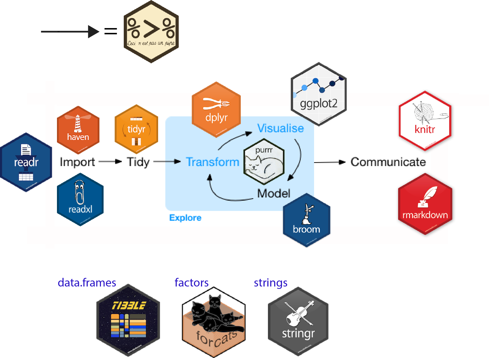

# Introduction {#intro}

R is a programming language dedicated to statistics and data analysis.

## Why R ?

* R is tailor made for data science
* Great for reproductibility (scripts, project)
* Do everything from the analysis to the reporting in one tool (thanks to [Rmarkdown](https://bookdown.org/yihui/rmarkdown/))

### R in GIS
Can we do GIS in R ? Yes !

And we can do R in GIS too !

#### R spatial

There is several tools for handling spatial data in R.
Historically, there was {sp}, {rgdal}, {rgeos} as core packages for geospatial data handling and dedicated packages for more advanced processing.

The {sf} package released a couple years ago is a modernisation of thoses packages. It connects directly to GDAL, GEOS and PROJ libraries and implements the [Simple Features Access](https://en.wikipedia.org/wiki/Simple_Features) into R. It is compatible with the [Tidyverse](https://www.tidyverse.org/) collection of R packages (more on that later).

See [r-spatial.github.io/sf](https://r-spatial.github.io/sf/) for more informations about {sf}.

#### R in QGIS

Since Sextante first release, you can use R scripts in QGIS Processing toolbox !

<a href="https://docs.qgis.org/3.4/en/docs/training_manual/processing/r_intro.html">Use R scripts in Processing</a>.

 
See the [R intro in the official documentation](https://docs.qgis.org/3.4/en/docs/training_manual/processing/r_intro.html)
 
#### RQGIS
[RQGIS](https://jannes-m.github.io/RQGIS/index.html) is R package that provides access to QGIS functionnality within the R environnement.

### RSAGA

There is also the [RSAGA](https://github.com/r-spatial/RSAGA) package to access SAGA processing tools within R.

### GRASS

You can use R in GRASS or GRASS in R too : see the [GRASS wiki](https://grasswiki.osgeo.org/wiki/R_statistics#How_to_use)

So there is a lot of connexions between R and the GIS world. In the R data science context, it becomes **geodata science** and adds tools to understand and visualize the dataset.

## Base R, Tidyverse and data.table

Base R is a set of functions shipped when you install R. Some of those functions were written by different people, not always developers, so even it is powerful it is not homogenous in the syntax or not always efficient (**avoid writing for loops in R**).

> As a language, R is like French; it has an elegant core, but every rule comes with a set of ad-hoc exceptions that directly contradict it.
http://r.cs.purdue.edu/pub/ecoop12.pdf

This critisism lead people to create packages to mitigate those issues.

The Tidyverse is a set of homogenous packages, providing a coherent syntax around verbs (*filter*, *select*, etc) and the possibility to pipe operations. 

<a href="https://lsru.github.io/tv_course/lecture01_intro.html#17">Data processing with R tidyverse - Ginolhac and al. 2017</a>.

It aims to provide readibility and understanding rather than performance (althought it sometimes provides both).

The Tidyverse is modular as you can load each packages separatly. We'll use mostly the {dplyr} package in this workshop.

data.table in the other end was created to be more efficient and can easily [compete with Python Pandas for example](https://h2oai.github.io/db-benchmark/).
data.table can handle very large datasets. Its syntax is close to Python Pandas but less readible by non programmers.

It is not closed worlds. You can mix all of these in your script like [Suzan Baert](https://suzan.rbind.io/) explained at [SatRday Paris 2019](https://youtu.be/vSU3o3c0-7U?t=1923). 

You can even mix R with Python if you need to with the Rpackage [reticulate](https://rstudio.github.io/reticulate/) or [rpy2](https://rpy2.readthedocs.io).

This document is based on geodata handling with {sf} and {dplyr} (from the Tidyverse toolset).

This can be followed on Rstudio or Jupyter R notebook.